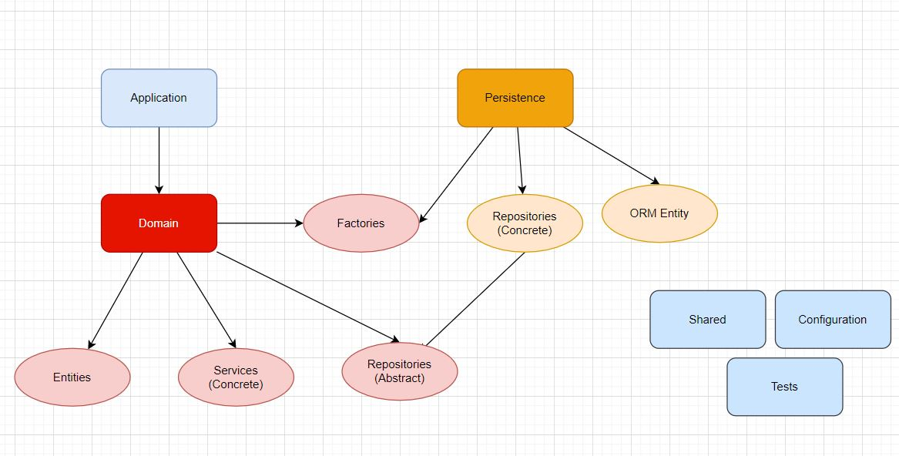

# REST API Blueprint

## Architecture

> Clean Architecture



## Design Pattern

- Factory
- DIP : Dependency inversion principle

## Rules

- SOLID

## Layers

> Application: api
> Domain : entities, contracts, services, factories, repositories (abstract)
> Persistence: repositories, orm entities
> Config: configuration class
> Shared: shared functions
> Tools: other tools

## Getting start

- Configuration: copy and replace related env

```bash
cp .env.sample .env
```

## Production

```bash
touch .env.production
echo "DATABASE_URL=mysql://root:123456@db/rest_api" > .env.production
```

## DB Migration

```bash
yarn typeorm migration:generate -n CreateUserTable
yarn typeorm migration:run
yarn typeorm migration:show
```

## Docker

### MYSQL

```bash
docker run --name jsguru-db -p 3307:3306 -e MYSQL_ROOT_PASSWORD=123456 -e MYSQL_DATABASE=rest-api -e MYSQL_USER=jsguru -e MYSQL_PASSWORD=123456 mysql:8.0.28 --character-set-server=utf8mb4 --collation-server=utf8mb4_unicode_ci
```
